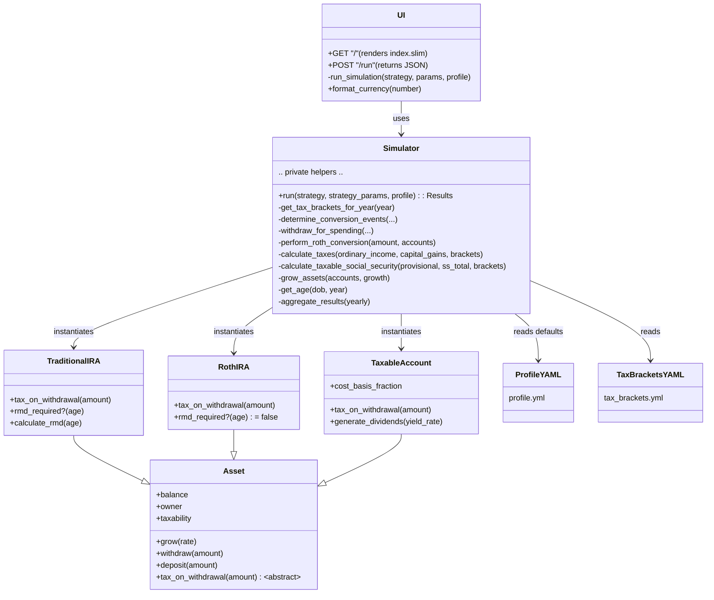
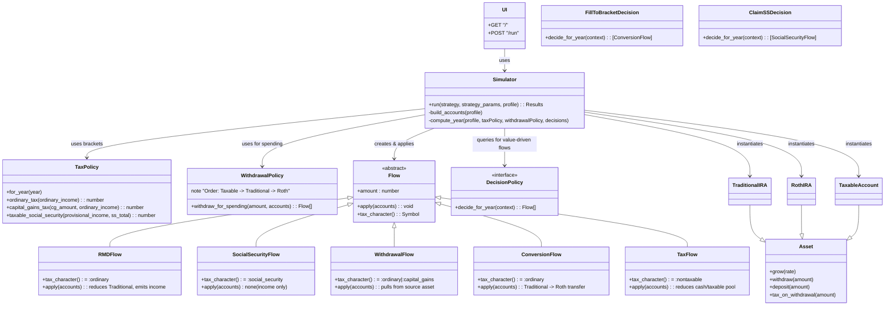

# Simple App – Object Hierarchy (Current vs Desired)

Edit this file freely. The diagrams are Mermaid, so they’re just text.

Tip: In VS Code or GitHub, Mermaid renders automatically. To change nodes or relations, edit the class names or arrows below.

---

## 1) Current state (reflects code today)

Assumptions: names shortened for readability. All classes live under the Ruby module `Foresight::Simple` unless otherwise noted.

Notes
- Routes live in `simple/app.rb` within `class UI < Sinatra::Base`.
- Domain objects live in `simple/lib/`.
- Data lives in `simple/profile.yml` and `simple/tax_brackets.yml`.

---

## 2) Desired state (Assets, Flows-with-Behavior, Decisions)

Goal: Keep everything joyful and minimal while acknowledging that flows have distinct rules and that decisions encode human values. No heavy frameworks. No speculative abstractions.

Changes from current:
- Keep `UI` and `Asset` classes as-is.
- Keep a single `Simulator`, but extract tiny, explicit helpers:
	- `TaxPolicy` (per-year brackets and SS thresholds; intention-revealing tax math)
	- `WithdrawalPolicy` (encapsulates withdrawal order logic)
- Model “Flows” as small behavioral objects (not plain structs): RMD, SocialSecurity, Withdrawal, Conversion, Tax. Each provides its own tax character and validation rules.
- Model “Decisions” (aka Actions/Strategies) as value-driven policies that propose flows, not mutate state directly.

Guardrails (to avoid the parent app’s complexity)
- Add a Flow subtype only when rules differ materially (e.g., RMD vs Conversion).
- Decisions must be pure: propose flows; the simulator applies them.
- Keep each Flow tiny: tax_character and apply(accounts) should be obvious and short.
- Keep files short and names intention-revealing.
- Avoid global state; pass explicit context.

---

### How to edit these diagrams
- Change class names, methods, or relations in the Mermaid blocks above.
- Common Mermaid arrows:
	- `A --|> B` inheritance
	- `A --> B` usage/association
	- `A ..|> B` interface implementation
- Keep it small and readable; this chart should fit in one screen.

