# Toggle Panel Flow Diagram

## Component Architecture


## Data Flow


## Nested Panel Layout Logic


## State Machine


## CSS Custom Properties Flow


## File Dependency Graph


## Usage Pattern: Simple vs Complex

### Simple (Recommended)
```slim
== toggleleft label: "Tools", icon: "🧰" do
  p Content here
```

**Score**: ⭐⭐⭐⭐⭐ (5/5)
- Minimal parameters
- Clear intent
- Self-documenting

### Complex (Current playground.slim)
```slim
== toggletop label: "Profiles", nested: true, expanded: "30vh", 
             collapsed: "2.25rem", push: nil, offset: "0" do
  .stack
    h3 Profiles Editor
```

**Score**: ⭐⭐⭐ (3/5)
- Too many parameters
- Redundant values (push: nil, offset: "0")
- Intent obscured

### Ideal (Proposed)
```slim
== toggletop "Profiles", nested: true, size: "30vh", stack: 0 do
  .stack
    h3 Profiles Editor
```

**Score**: ⭐⭐⭐⭐ (4/5)
- Fewer parameters (5 vs 7)
- Clearer intent
- Good balance

---

## Key Metrics

| Aspect | Score | Evidence |
|--------|-------|----------|
| **Ruby Elegance** | 9/10 | Expressive helpers, minimal code |
| **CSS Quality** | 9/10 | Clean BEM, custom properties, progressive enhancement |
| **JS Complexity** | 6/10 | 365 lines, nested layout logic is intricate |
| **Slim Template** | 8/10 | Clear, minimal, good variable names |
| **Documentation** | 4/10 | Inline comments exist, but no formal docs |
| **Testing** | 0/10 | No tests found |

## Philosophy Adherence

```mermaid
graph LR
    A[Ode to Joy] --> B[✅ Clarity]
    A --> C[✅ Minimalism]
    A --> D[⚠️ DRY]
    A --> E[✅ POLA]
    A --> F[⚠️ No Brittleness]
    
    B -.->|Clean names| G[toggle_panel__content]
    C -.->|CSS-first| H[":hover expands"]
    D -.->|Violation| I[Dual implementations]
    E -.->|Predictable| J[Hover=preview, Click=stick]
    F -.->|40-line function| K[_updateNestedPositions]
    
    style I fill:#ffebee
    style K fill:#fff9c4
```



---

*Visual diagrams for togglepanel analysis - October 10, 2025*
